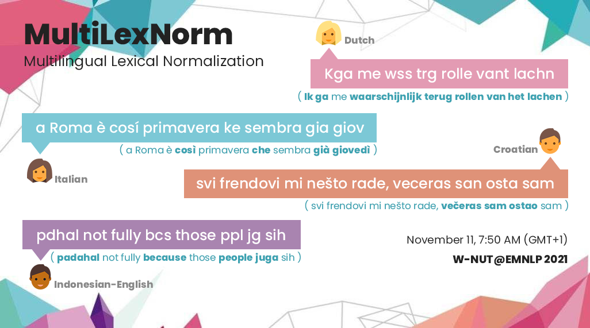

## Multilingual Lexical Normalization

[]()


This is the repository belonging to the shared task on multilingual lexical normalization at WNUT 2021. More info can be found on [noisy-text.github.io/2021/multi-lexnorm.html](noisy-text.github.io/2021/multi-lexnorm.html)

This repository contains all data pre-processed in the same format:

```
Most	most
social	social
pple	people
r	are
troublesome	troublesome

```

Some of the languages include annotation for word splits and merges. When a
word is split, the normalization column include a white-space character, and
with a merge the normalization is only included for the first word:

```
if      If
i       i
have    have
a       a
head    headache
ache
tomorro tomorrow
ima     i'm going to
be      be
pissed  pissed

```

To read this data properly in python3, do not use `.strip().split()`, but use `.strip('\n').split('\t')` instead.

contents:

* data: contains the data per language. Note that development data is only included for the larger sets, for the smaller ones we suggest to use k-fold.
* scripts: baseline and evaluation scripts.
* extrEval: data and scripts for extrinsic evaluation

For any problems with the data (annotation), please post on  https://groups.google.com/u/2/g/multilexnorm or e-mail the first author of the overview paper.


## Citation

The citation for this dataset is:
```
@inproceedings{multilexnorm,
  title= {{MultiLexNorm}: A Shared Task on Multilingual Lexical Normalization},
  author = "van der Goot, Rob and Ramponi, Alan and Zubiaga, Arkaitz and Plank, Barbara and Muller, Benjamin  and San Vicente Roncal, I\~{n}aki and Ljube\v{s}i\'{c}, Nikola  and \c{C}etino\u{g}lu, {\"O}zlem  and Mahendra, Rahmad  and \c{C}olako\u{g}lu, Talha  and Baldwin, Timothy  and Caselli, Tommaso  and Sidorenko, Wladimir",
  booktitle = "Proceedings of the 7th Workshop on Noisy User-generated Text (W-NUT 2021)",
  year = "2021",
  publisher = "Association for Computational Linguistics",
  address = "Punta Cana, Dominican Republic"
}
```

We would also strongly encourage you to cite the original papers if you use this data:
```
We use the MultiLexNorm dataset~\cite{multilexnorm,plank-etal-2020-dan,sidarenka2013rule,baldwin-etal-2015-shared,alegria2013introduccion,11356/1170,barik-etal-2019-normalization,van-der-goot-etal-2020-norm,dutchNorm,11356/1123,11356/1171,colakoglu-etal-2019-normalizing,van-der-goot-etal-2021-lexical}
```

The corresponding bib files are listed below:

```
@inproceedings{plank-etal-2020-dan,
    title = "{D}a{N}+: {D}anish Nested Named Entities and Lexical Normalization",
    author = "Plank, Barbara  and
      Jensen, Kristian N{\o}rgaard  and
      van der Goot, Rob",
    booktitle = "Proceedings of the 28th International Conference on Computational Linguistics",
    month = dec,
    year = "2020",
    address = "Barcelona, Spain (Online)",
    publisher = "International Committee on Computational Linguistics",
    url = "https://www.aclweb.org/anthology/2020.coling-main.583",
    doi = "10.18653/v1/2020.coling-main.583",
    pages = "6649--6662",
}

@inproceedings{sidarenka2013rule,
  title={Rule-based normalization of {G}erman {T}witter messages},
  author={Sidarenka, Uladzimir and Scheffler, Tatjana and Stede, Manfred},
  booktitle={Proc. of the GSCL Workshop Verarbeitung und Annotation von Sprachdaten aus Genres internetbasierter Kommunikation},
  year={2013}
}

@inproceedings{baldwin-etal-2015-shared,
    title = "Shared Tasks of the 2015 Workshop on Noisy User-generated Text: {T}witter Lexical Normalization and Named Entity Recognition",
    author = "Baldwin, Timothy  and
      de Marneffe, Marie Catherine  and
      Han, Bo  and
      Kim, Young-Bum  and
      Ritter, Alan  and
      Xu, Wei",
    booktitle = "Proceedings of the Workshop on Noisy User-generated Text",
    month = jul,
    year = "2015",
    address = "Beijing, China",
    publisher = "Association for Computational Linguistics",
    url = "https://www.aclweb.org/anthology/W15-4319",
    doi = "10.18653/v1/W15-4319",
    pages = "126--135",
}

@inproceedings{alegria2013introduccion,
  title={Introducci{\'o}n a la Tarea Compartida {Tweet-Norm} 2013: Normalizaci{\'o}n L{\'e}xica de Tuits en {E}spa{\~n}ol.},
  author={Alegria, Inaki and Aranberri, Nora and Fresno, V{\'\i}ctor and Gamallo, Pablo and Padr{\'o}, Lluis and San Vicente, Inaki and Turmo, Jordi and Zubiaga, Arkaitz},
  booktitle={Tweet-Norm@ SEPLN},
  pages={1--9},
  year={2013}
}

@misc{11356/1170,
 title = {Croatian {T}witter training corpus {ReLDI}-{NormTagNER}-hr 2.0},
 author = {Ljube{\v s}i{\'c}, Nikola and Erjavec, Toma{\v z} and Mili{\v c}evi{\'c}, Maja and Samard{\v z}i{\'c}, Tanja},
 url = {http://hdl.handle.net/11356/1170},
 note = {Slovenian language resource repository {CLARIN}.{SI}},
 copyright = {Creative Commons - Attribution 4.0 International ({CC} {BY} 4.0)},
 year = {2017} 
}

@inproceedings{barik-etal-2019-normalization,
    title = "Normalization of {I}ndonesian-{E}nglish Code-Mixed {T}witter Data",
    author = "Barik, Anab Maulana  and
      Mahendra, Rahmad  and
      Adriani, Mirna",
    booktitle = "Proceedings of the 5th Workshop on Noisy User-generated Text (W-NUT 2019)",
    month = nov,
    year = "2019",
    address = "Hong Kong, China",
    publisher = "Association for Computational Linguistics",
    url = "https://www.aclweb.org/anthology/D19-5554",
    doi = "10.18653/v1/D19-5554",
    pages = "417--424",
}

@inproceedings{van-der-goot-etal-2020-norm,
    title = "Norm It! Lexical Normalization for {I}talian and Its Downstream Effects for Dependency Parsing",
    author = "van der Goot, Rob  and
      Ramponi, Alan  and
      Caselli, Tommaso  and
      Cafagna, Michele  and
      De Mattei, Lorenzo",
    booktitle = "Proceedings of the 12th Language Resources and Evaluation Conference",
    month = may,
    year = "2020",
    address = "Marseille, France",
    publisher = "European Language Resources Association",
    url = "https://www.aclweb.org/anthology/2020.lrec-1.769",
    pages = "6272--6278",
    language = "English",
    ISBN = "979-10-95546-34-4",
}

@mastersthesis{dutchNorm,
  author       = {Schuur, Youri}, 
  title        = {Normalization for {D}utch for improved POS tagging},
  school       = {University of Groningen},
  year         = 2020,
  url         = {http://robvanderg.github.io/doc/normalization_dutch.pdf}
}

@misc{11356/1123,
 title = {{CMC} training corpus {Janes-Tag} 2.0},
 author = {Erjavec, Toma{\v z} and Fi{\v s}er, Darja and {\v C}ibej, Jaka and Arhar Holdt, {\v S}pela and Ljube{\v s}i{\'c}, Nikola and Zupan, Katja},
 url = {http://hdl.handle.net/11356/1123},
 note = {Slovenian language resource repository {CLARIN}.{SI}},
 copyright = {Creative Commons - Attribution-{ShareAlike} 4.0 International ({CC} {BY}-{SA} 4.0)},
 year = {2017} 
}

@misc{11356/1171,
 title = {Serbian {T}witter training corpus {ReLDI}-{NormTagNER}-sr 2.0},
 author = {Ljube{\v s}i{\'c}, Nikola and Erjavec, Toma{\v z} and Mili{\v c}evi{\'c}, Maja and Samard{\v z}i{\'c}, Tanja},
 url = {http://hdl.handle.net/11356/1171},
 note = {Slovenian language resource repository {CLARIN}.{SI}},
 copyright = {Creative Commons - Attribution 4.0 International ({CC} {BY} 4.0)},
 year = {2017} 
}

@inproceedings{colakoglu-etal-2019-normalizing,
    title = "Normalizing Non-canonical {T}urkish Texts Using Machine Translation Approaches",
    author = {{\c{C}}olako{\u{g}}lu, Talha  and
      Sulubacak, Umut  and
      Tantu{\u{g}}, Ahmet C{\"u}neyd},
    booktitle = "Proceedings of the 57th Annual Meeting of the Association for Computational Linguistics: Student Research Workshop",
    month = jul,
    year = "2019",
    address = "Florence, Italy",
    publisher = "Association for Computational Linguistics",
    url = "https://www.aclweb.org/anthology/P19-2037",
    doi = "10.18653/v1/P19-2037",
    pages = "267--272"
}

@inproceedings{van-der-goot-etal-2021-lexical,
    title = "Lexical Normalization for Code-switched Data and its Effect on {POS} Tagging",
    author = "van der Goot, Rob  and
      \c{C}etino{\u{g}}lu, {\"O}zlem",
    booktitle = "Proceedings of the 16th Conference of the {E}uropean Chapter of the Association for Computational Linguistics: Volume 1, Long Papers",
    month = feb,
    year = "2021",
    publisher = "Association for Computational Linguistics"
}
```
